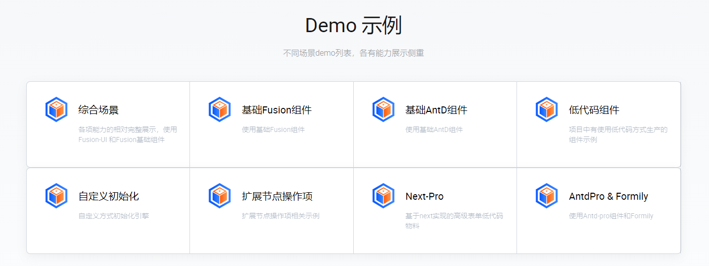
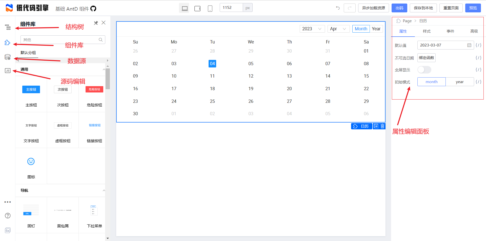
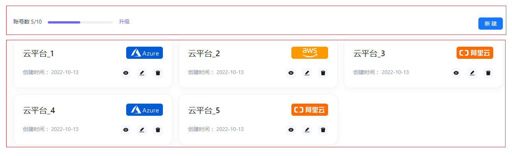
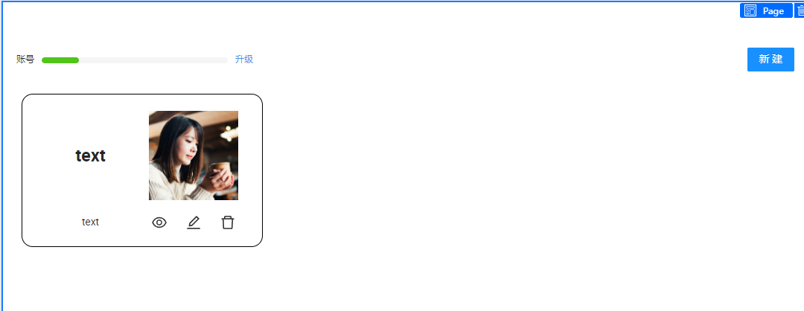
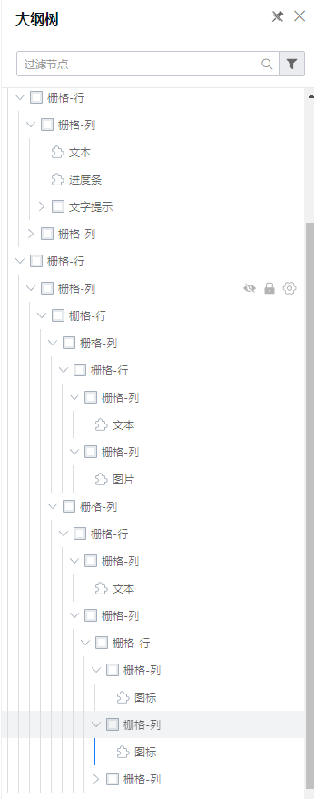
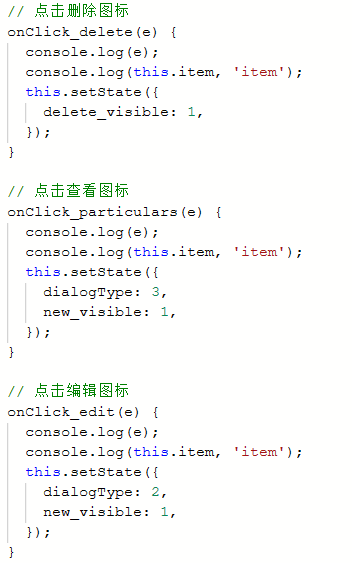
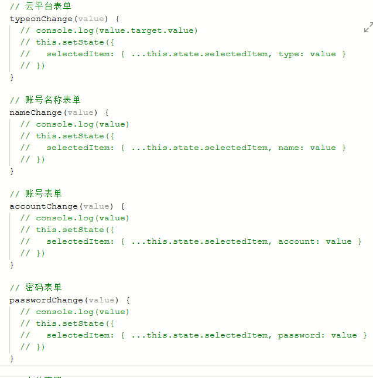

# 低代码引擎实现 demo

为了帮助大家更好的了解和学习低代码引擎，我们这里通过实现一个 demo 来帮助开发人员可以快速了解低代码引擎的使用和流程。

## 低代码引擎介绍

相信很多人都听说过低代码，那 [阿里低代码引擎](https://lowcode-engine.cn/index) 是干什么的呢？和低代码有什么关系？其实低代码引擎算一个设计器，具备强大扩展能力的低代码研发框架。主要就是帮助开发自己的低代码平台。

## 低代码引擎功能介绍

### demo 示例介绍

Demo 根据不同的设计器所需要的物料不同，分为了下面的 8 个场景：

- 综合场景
- 基础 fusion 组件
- 基础 fusion 组件 + 单自定义组件
- 基础 antd 组件
- 自定义初始化引擎
- 扩展节点操作项
- 基于 next 实现的高级表单低代码物料
- antd 高级组件 + formily 表单组件

### AntD 示例功能介绍

- 结构树便是各个组件构成的页面
- 组件库，里边有一些常用的控件
- 数据源，主要和后台交互
- 源码编辑，可以在这里定义一些函数和样式
- 属性面板，最后是右侧属性面板，这部分主要用来设置所选区域或者控件的一些属性、外观、事件等等。每个组件都预置了不同的属性和外观。

## demo 原型解析和实现

如图，我们选择了一个简单的 demo，在使用低代码引擎实现时按照功能将页面分为两部分

在低代码引擎中我们使用最多的就是布局容器，将页面内分为两部分能跟好的方便我们操作,下面是我们已经按照原型做好的布局

这里放上结构树方便查看

在我们完成布局后就要制作交互效果了,为了有更直观的效果录制了视频，可以供大家参考：

<!-- <video height=400 width=500 src="./img/demo-succeed.mp4"> -->

[视频](https://github.com/lylxj/markdown/blob/main/%E4%BD%8E%E4%BB%A3%E7%A0%81%E5%BC%95%E6%93%8E/img/demo-succeed.mp4)

### 未完成部分

当你看完视频后会发现功能没有实现完，这是应为剩下功能无法完成，对比宜搭，这是一个搭建低代码平台的工具，其中 demo 示例并不完全，我们梳理一下哪些没有完成

1. 查看功能
2. 编辑功能
3. 删除功能

这几个功能都是点击图标后获取不到所循环的数据，无法对数据做查看、修改、删除

### 踩坑点

在制作新增时给每个 input 输入框加入了 change 事件每当值变化时却无法获取到，最后试验过后发现给表单容器自身绑定 onValuesChange 事件可获取值

## 总结

阿里低代码引擎属于一种低代码研发框架，是为了开发“低代码平台”而存在的。此外，该引擎还提供了易于使用的界面和工具，以帮助开发人员更快地构建应用程序然而，阿里低代码引擎也存在一些潜在的问题和限制。该工具的可扩展性和灵活性可能也受到限制，因为它可能无法满足某些特定需求或应用程序的需求。
